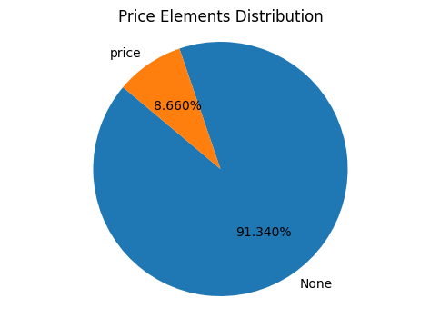
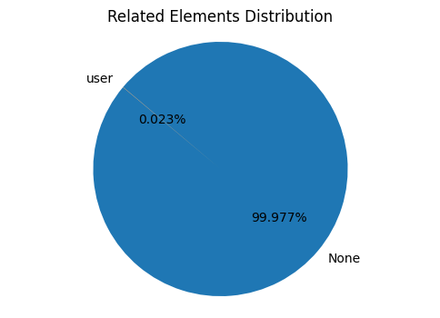
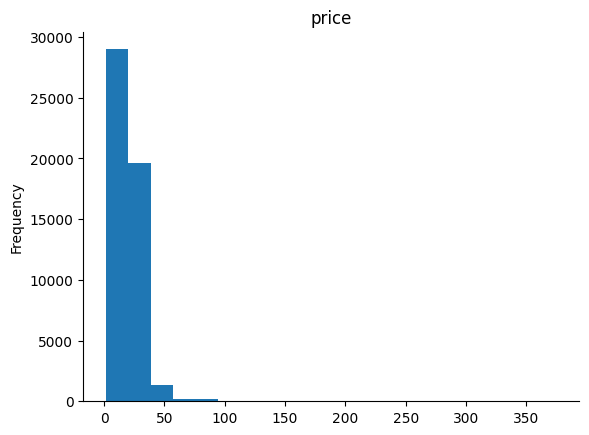
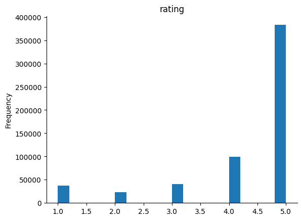
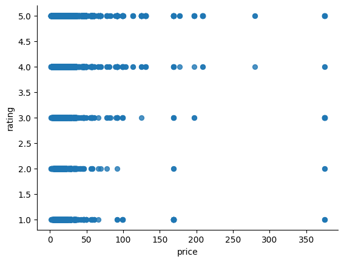
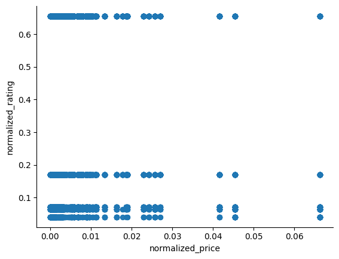
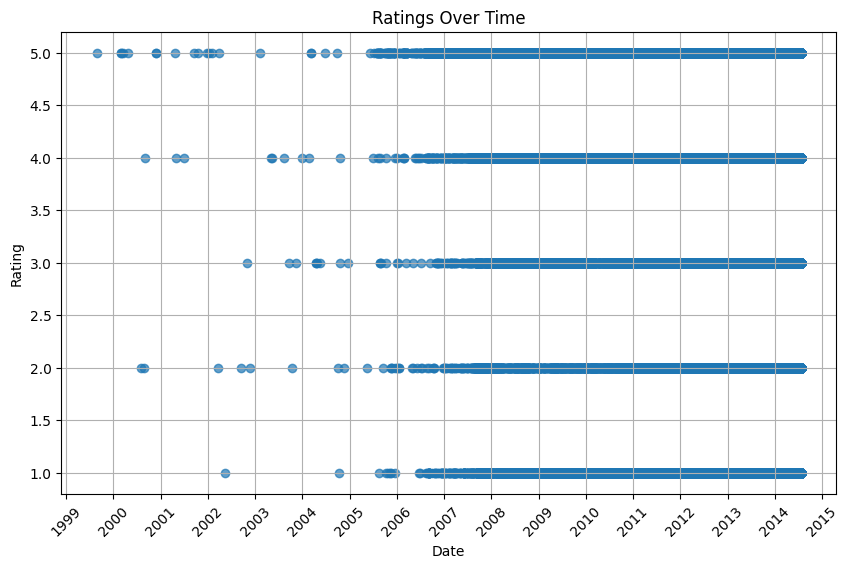
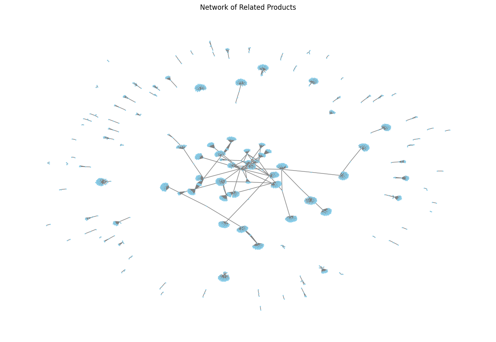
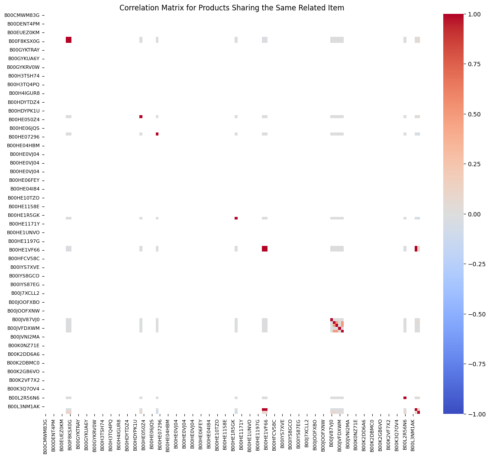

---
author:
- Lovenesh Bhardwaj, Miotto Pietro
date: May 18, 2024
title: Data Analytics - Project 1 / Group Number 3 - Video Sharing
---

# Introduction {#sec:introduction}

This document outlines the methodology and results for the Data
Analytic's Project 2. Here, a group of two students was tasked to apply
concepts seen in class to describe and analyse a given data set. The
group consists of the following students:

-   Bhardwaj Lovenesh

-   Miotto Pietro

Our group has been tasked to predict products' ratings for some users
based on other users' ratings. The dataset contains information on user
preference data on instant video as well as information about each rated
item. We were given with:

-   a JSON file of $583933$ entries (i.e. products). Each one of these
    JSON objects, identified by `asin`, which is the porduct id (e.g.
    0000031852), contains information about:

    -   title: name of the product

    -   price: price in US dollars (at time of crawl)

    -   imUrl: url of the product image

    -   related: related products (also bought, also viewed, bought
        together, buy after viewing)

    -   salesRank: sales rank information

    -   brand: brand name

    -   categories: list of categories the product belongs to

-   an `EXCEL` file of $583933$ rows, which, for each user (identified
    by an id), gives the following informations:

    -   asin: id of the reviewed product

    -   rating: rating of the product

    -   timestamp: time of the review

We were tasked to use python and additional libraries to address the
following points:

-   Data exploration and description

-   Pre-processing the data

-   Build two recommendation systems to predict/estimate ratings for
    users on product they haven't bought yet.

-   Test the accuracy of the two models using the test data

# Data Exploration, Description and Preprocessing {#sec:1}

## First Insights

The first step we made towards describing and analyizing the dataset,
was to explore and understand the `JSON` file. The main issue with this
file is that it wasn't formatted correctly and was very sparse. A lot of
entries were empty or did not exist for most of the products. In
addition, the JSON Object entries for `title`, `imUrl`, `salesRank`,
`brand` did not exist in our dataset. Furthemore, as you can see in
[3](#fig:rel){reference-type="ref" reference="fig:rel"}, only $137$
products over $583796$ had a related entry. This means that $0.023\%$ of
all products had information about related products. Also, the only
`related` category present was `also_viewed`, there was no trace of
other categories such as `also_bought`, `bought_together`,
`buy_after_viewing`. Lastly, as you can see in
[1](#fig:pr){reference-type="ref" reference="fig:pr"}, also the
information about prices are very sparse: only $50571$ products over
$583796$ (i.e. $8.7\%$ ) had information about their price. But this
percentage is in line with the average spsrity of a dataset.

<figure id="fig:rel">
<figure id="fig:pr">

<figcaption> Piechart of
price labels</figcaption>
</figure>
<figure id="fig:rel">

<figcaption> Piechart of
price labels</figcaption>
</figure>
<figcaption>Side by side piecharts of category labels</figcaption>
</figure>

## Data Pre-Processing

As first, we created a function which formats the `JSON` file correctly.
The main issue of the file was the use of single quotes instead of
double quotes and the fact that there where multiple json objects per
line. Once re-formatted, the `JSON` file is overwritten and imported as
a pandas dataframe. After that, we import also the `Excel` file as a
pandas dataframe. We merge the two datafremes on the product id. We thus
obtain a dataframe structured like this, with $583796$ rows and $7$
columns:

::: {#tab:amazon_ratings}
   **Index**    **ASIN**    **Categories**   **Price**   **Related**    **User ID**     **Rating**   **Timestamp**
  ----------- ------------ ---------------- ----------- ------------- ---------------- ------------ ---------------
       0       B000GFDAUG       A.I.V.          NaN          NaN       A1EE2E3N7PW666      5.0        1202256000
       1       B000GFDAUG       A.I.V.          NaN          NaN       AGZ8SM1BGK3CK       5.0        1198195200
       2       B000GIOPK2       A.I.V.          NaN          NaN       A2VHZ21245KBT7      4.0        1215388800
       3       B000GIOPK2       A.I.V.          NaN          NaN       ACX8YW2D5EGP6       4.0        1185840000
       4       B000GIOPK2       A.I.V.          NaN          NaN       A9RNMO9MUSMTJ       2.0        1281052800
       5       B000GIOPK2       A.I.V.          NaN          NaN       A3STFVPM8NHJ7B      5.0        1203897600
     \...         \...           \...          \...         \...            \...           \...          \...

  : Amazon Instant Video Ratings, 'A.I.V.' stands for 'Amazon Instant
  Video'
:::

\
After that, only for visibility purposes, we add to the dataframe a
column labeled as `readable_date`, which contains the timestamp
re-factored as human-readbale dates, e.g. `1202256000` becomes
`2008-02-06`

## Data Visualization

### Prices and Reviews

The first visualization on data was to see how price and ratings are
distributed. From [6](#fig:revh){reference-type="ref"
reference="fig:revh"} we can see that ratings have a tendency to be
high, in fact, the `3`, `2` and `1` star ratings combined appear less
than $150.000$, which, over almost $600.000$ total ratings, represents
an astonishingly low number of bad reviews. Instead, by looking at
[4](#fig:prh){reference-type="ref" reference="fig:prh"}, we can see how
prices tend to concentrate on low values, the majority is less than $25$
dollars. Lastly, we also plot a scatter on how prices are related to
reviews. As shown in [7](#fig:prs){reference-type="ref"
reference="fig:prs"}, the scatter plot shows a dispersed pattern without
any clear linear trend. For this reason, we compute also a scatter plot
(as in [9](#fig:prsn){reference-type="ref" reference="fig:prsn"}) where
the prices and reviews are normalized w.r.t to their frequency,with the
aim to identify frequent combinations of price and rating values. We
still see a dispersed pattern. Thus, we conclude that there is no strong
correlation between price and rating, and we must look for more
significant and robust values.

<figure id="fig:revh">
<figure id="fig:prh">

<figcaption> Histogram of
price frequencies</figcaption>
</figure>
<figure id="fig:revh">

<figcaption> Histogram
of rating frequencies</figcaption>
</figure>
<figcaption>Price and Ratings frequencies</figcaption>
</figure>

<figure id="fig:prsn">
<figure id="fig:prs">

<figcaption> Scatterplot
of price and ratings</figcaption>
</figure>
<figure id="fig:prsn">

<figcaption>
Scatterplot of price and ratings normalized w.r.t.
frequencies</figcaption>
</figure>
<figcaption>Price and Ratings Scatterplots</figcaption>
</figure>

::: wrapfigure
r0.3 {width="40%"} []{#fig:scatt
label="fig:scatt"}
:::

### Time and Ratings

In order to find some interesting correlations, we plotted also the
scatter on how timestamps relates to ratings. Here, since timestamps are
human un-readable and span trough a period of almost 15 years, we show
in the plot only the years. As shown in this scatterplot, there is no
relevant correlation between ratings and specific years, the only
noticeable correlation is between $1999$ and $2003$ where almost all (of
the few) ratings are of $5$ stars. This alignes with this dataset
tendency for higher ratings, but still reflects an interesting
correlation, despite the fact that it concerns a really small sample of
the dataset (i.e. the few ratings back in time). Lastly, note that, as
imagined, there are fewer ratings from previous years.

### Piecharts

We compute Piecharts of the most relevant values. As already stated
above, we assess the sparisty of the dataframe. After that, as in
[\[fig:piecat\]](#fig:piecat){reference-type="ref"
reference="fig:piecat"}, we compute the piechart for the category, to
have the confirm that all the products are of one specific category,
i.e. Amazon Instant Video. Given that this category is always the same,
we will not take it into consideration, by removing it from the
dataframe and from the correlation plot.

### Correlation Plot

As shown in [\[fig:corrmatrix\]](#fig:corrmatrix){reference-type="ref"
reference="fig:corrmatrix"}, we also plot a correlation matrix between
`price`, `timestamps`, `rating`, `user_id_`, where '`_`' means that,
being the user id an alphanumeric variable, we converted it into a
numerical value so that it can be included in the correlation matrix. As
visible at first sight, there is no interesting correlations.

### Related

Given that, as shown above, only $0.023\%$ of all the items in our
dataset had a `’related’` information, we initially did not accounted
for that in exploring possible correlations. Nevertheless, because of
the poor results in terms of correlations, we decided to investigate if
this value could somewhat show correlations with the ratings. Recall
that, for a specific item, the `’related’` value contains a list of
products that users typically view after purchasing the item. The first
step was to visualize the graph of how related products where connected,
i.e. how sparse the network would have been. As we can see in
[10](#fig:net){reference-type="ref" reference="fig:net"}, most of the
network is composed of outliers, indicating products that do not share
related products with others. However, there is a core cluster where
products are interconnected, suggesting that these products frequently
appear together as related items. This cluster may indicate a group of
products that are commonly viewed together by users, potentially
revealing an underlying pattern or trend in user behavior. Given this
interesting insight, we deepened our investigation. We plot a
Correlation Matrix and Heatmap showing how the relationships between
products links to ratings: we build an asymmetric matrix where if
*product A* lists *product B* in its `also_viewed` list, it sets the
respective cell to $1$, indicating that users who viewed *product A*
also viewed *product B*. Then correlates this relationship with ratings.
As shown in [12](#fig:heat){reference-type="ref" reference="fig:heat"},
in general the matrix is very sparse and the correlation is low, but
there are some noticeable relationships which highly correlate to
similar ratings (by 'highly' I mean a slightly red color of the
heatmap). This results, given how sparse is the dataset, lead us to
consider the `’related’` as an extremely valuable information for the
deployment of our Recommender Systems.

<figure id="fig:heat">
<figure id="fig:net">

<figcaption> Network of
related products</figcaption>
</figure>
<figure id="fig:heat">

<figcaption>
Correlation Matrix of related product mentioning each other and
rating</figcaption>
</figure>
<figcaption>Relevant plot for <code>related</code>
information</figcaption>
</figure>

# First Recommender System

## Data Pre-Processing

As stated above, the information regarding the related products has to
be taken into account, while the category information can be discarded.
At first, therefore, we define a function `handle_related_column` which
access the dictionary `also_viewed` (the only one we have) of related
elements. If this dictionary is empty it returns $0$, otherwise it
returns the length of the dictionary, i.e. how many related products are
in the list. Given the dataframe, we drop the `Category` column, we
replace the missing `price` values with the mean and we call the
`handle_related_column` function over the `related` column. This allows
us to treat this information in a simple way, i.e. it gives us the
number of also viewed products.

## Splitting in Train and Test Set

We use `sklearn train_test_split` module to split the dataframe in train
and test set. We then drop the rating column from the test set.

## Model and Procedure

For this first model, we will use functions and classes from the library
`Surprise`, which is a library specifically designed for building and
evaluating recommender systems. We instantiate a `Reader()` object,
which defines the scale of our predictions (in this case the rating
scale), and we create the proper Dataset istance that is to be used
later by our Recommender System. We split this dataset in proper
training and test set for the surprise library, so that we are then able
to run `SVD` RS. Recall that SVD is a matrix factorization technique
which computes latent factors that explain observed user-item
relationships. SVD decomposes a user-item interaction matrix into three
smaller matrices that capture the underlying patterns in the data. Based
on these latent factor, the model can estimate missing entries, i.e.
predicting how a user might rate an unseen item based on these latent
factors.

## Model Evaluation

::: {#tab:predicted_actual_ratings}
            **Index**             **Predicted Rating**   **Actual Rating**
  ------------------------------ ---------------------- -------------------
              521213                    4.720074                5.0
              45709                     4.664076                5.0
              480425                    4.539886                3.0
              55281                     3.886119                5.0
              147281                    4.317056                1.0
   **RMSE: 1.0508151241203094**                         

  : Predicted and Actual Ratings
:::

Please note that SVD model, in Surprise library, uses basic interaction
data (i.e. usres id, products id and ratings) to train and thus being
able to learn the latent factors and creating the matrix. This model's
performance is then assessed using a more comprehensive dataset that
includes additional contextual information ( in our case timestamps,
related values and prices). By running SVD on the test set (i.e. the
dataframe withouth `rating` column), we compute model's prediction and
we attach them to the dataframe in a specific column. We thus obtain a
`comparison_df`, which contains predicted and original ratings. To
evaluate how well the model performed, we rely on the **Root Mean
Squared Error**, which basically computes the difference between the
actual value(rating) and the predicted value, so that the absolute value
of the residual is squared and the square root of the whole term is
taken for comparison. We get a `RMSE` value of $1.0$, which means that,
on average, the predictions are 1 star less or more than the actual
ones. Given how sparse and inconsistent was our dataset, this is a good
result.

# Second Recommender System

## Data Pre-Processing

For this second Recommender System, we need to treat time-related
contextual information in a more significant way. For this reason, we
add to our dataframe three columns ( one for year, one for month and one
for day), so that the timestamps are processed in a more meaningful and
human/Neural-Network-readable format. Also, note that, only in the
pytorch Dataset, we will account also for the day of the week
information. In addition, we encode `user_id` and `asin`, which are
alphanumeric, into integers. We then order the dataset so that it
respects temporal order. From our dataframe, we create a Dataset class
that takes a dataframe as input and istantiates a `pytorch` Dataset
object. We split the dataframe in training and test based on the time
(i.e. the training set thus includes the first 80% of the data, sorted
by time, and the test set 20% of the latest) and istantiate the
respective train and test pytorch `Datasets` and pytorch `DataLoaders`,
both with `batch_size=512`.

## Model

As model we use a `RecommenderNet` Neural Network. This Neural Network
is composed of two embedding layers (one for user and one for items),
which encaptures the latent factors in terms of user preferences and
item's charachetristics, and three fully connceted/feedforward
`nn.Linear` layers. The first fully connected layer, namely `self.fc1`,
concatenates the user and items embeddings with 6 additional features
(day, month, year, day of the week, related and price). The other fully
connected layers allows us to pass from this insanely high-dimensional
output, to a single value output (i.e. the rating). On the first two
fully connceted layer we apply a `Relu` activation function to inject
non-linearity. Note that the model is istantiated by specifing number of
users and number of items (used for building the emebdding layers) and
an `embedding_size`, which, in our case, is $50$.

## Training and Evaluation

We train the model on `GPU` (if available). We use `Adam` as optimizer
and `MSE` (i.e. Mean Squared Error) as evaluation criterion for
assessing how distant the predicitions are from real values. We use `15`
epochs and a standard `learning_rate` of $0.001$. Note that we use few
epochs, given how many batches of data we are processing
(`batch_size=512` is a high number of batches, but necessary given how
large is our dataset and how complex the embeddings).

## Model Evaluation

::: {#tab:predicted_actual_ratings}
         **Day of Week**          **Predicted Rating**   **Actual Rating**
  ------------------------------ ---------------------- -------------------
                4                       3.257990                5.0
                4                       4.986308                5.0
                4                       4.965138                5.0
                4                       4.488194                3.0
                4                       5.109684                5.0
   **RMSE: 1.3874093239329934**                         

  : Predicted and Actual Ratings with Day of Week
:::

After running the model in `.eval()` mode on the test set, we define, as
above, a `comparison_df` and we compute the `RMSE`. We get a RMSE value
of $1.4$ slightly higher than the one obtained with the privious model.
Also, note that this model has no boundary on ratings, thus it can
assign ratings of more than 5 and less then 1.
